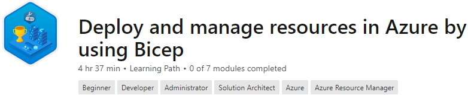

# A repository full of practical syntax examples for Bicep languange

## Welcome
Hi there! It's been a while since I've started my journey with BicepLang and I wanted to share with all of you the templates that I've been authoring. For that reason, I've created this public Github repo that contains reusable templates. I haven't yet moved or refactored all of them yet, but we are getting there, soon :) Enjoy!

## Required Toolset
Some of you may have already started authoring Bicep Templates, for those who haven't, consider using the following tools for best authoring experience.

* [Bicep CLI](https://github.com/Azure/bicep/releases/latest/download/bicep-setup-win-x64.exe) - Compiles Bicep files into ARM templates. Cross-platform.
* [Visual Studio Code](https://aka.ms/vscode) - For authoring Bicep Templates
* [Bicep VS Code Extension](https://marketplace.visualstudio.com/items?itemName=ms-azuretools.vscode-bicep) - Authoring support, intellisense, validation. Optional, but recommended

## Bicep learning path on Microsoft Learn

Take this [learning path](https://docs.microsoft.com/en-us/learn/paths/bicep-deploy/) to get started with Bicep.

## Additional learning materials

* Books
    * [Getting started with Bicep: Infrastructure as code on Azure](https://www.amazon.com/Getting-started-Bicep-Infrastructure-Azure/dp/B098WK3MR7)
